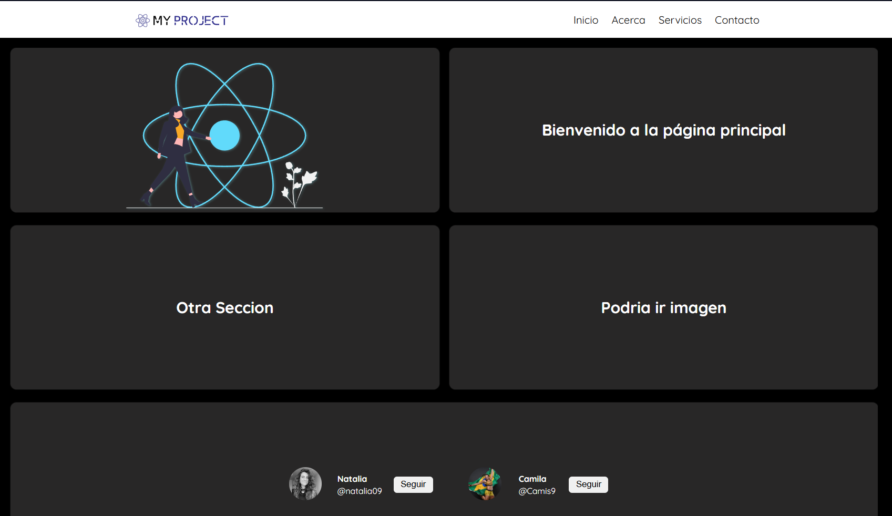

# Projects-React
Colección de proyectos usando React de todos los niveles. Desde lo básico hasta lo avanzado.

1. Primer proyecto: Un breve acercamiento a la creación de componentes.

2. Lista de Tareas (To-Do-List)
Descripción: Una aplicación sencilla donde los usuarios pueden agregar, marcar como completadas y eliminar tareas.
## 📌 Características
✔️ Agregar tareas  
✔️ Marcar tareas como completadas  
✔️ Eliminar tareas  
✔️ Diseño minimalista con Tailwind 

